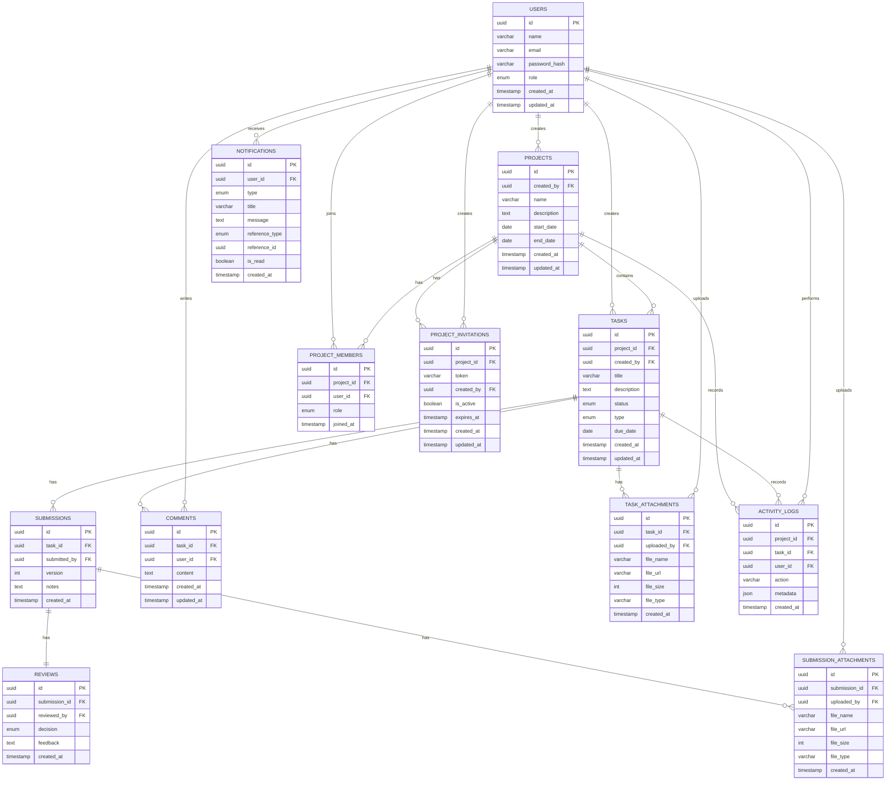

# 📘 04 - ERD & Database Design

## Freelancer Project Management Tool (FPMT)

---

## 1. 📌 Overview

This document defines the Entity Relationship Diagram (ERD) and database design for the Freelancer Project Management Tool.

The database design supports:

- User authentication and role-based access
- Project management
- Client invitation via link
- Task lifecycle management
- Task submissions and revisions
- Review and approval flow
- Comments and communication
- File attachments
- In-app notifications
- Activity logs

This document is based on the Project Overview, BRD, and PRD.

---

## 2. 🧩 Database Design Goals

The database should be designed to:

- Support multiple projects per user
- Support multiple users per project
- Clearly separate freelancer and client access
- Preserve revision history
- Track all important project activities
- Support notification history
- Keep the structure simple enough for MVP development
- Remain scalable for future improvements

---

## 3. 🗂️ Core Entities

The main entities are:

- User
- Project
- Project Member
- Project Invitation
- Task
- Submission
- Review
- Comment
- Task Attachment
- Submission Attachment
- Notification
- Activity Log

---

## 4. 👤 Users Table

Stores registered users.

| Field         | Type      | Constraint / Notes |
| ------------- | --------- | ------------------ |
| id            | UUID      | Primary Key        |
| name          | varchar   | Required           |
| email         | varchar   | Required, unique   |
| password_hash | varchar   | Required           |
| role          | enum      | freelancer, client |
| theme         | enum      | light, dark, system; default light |
| created_at    | timestamp | Required           |
| updated_at    | timestamp | Required           |

### Notes

- A user can be a freelancer or client.
- A freelancer can create many projects.
- A client can join many projects through invitation links.
- One user can belong to multiple projects.
- `theme` stores the user's preferred interface theme.

---

## 5. 📁 Projects Table

Stores project information.

| Field       | Type      | Constraint / Notes     |
| ----------- | --------- | ---------------------- |
| id          | UUID      | Primary Key            |
| created_by  | UUID      | Foreign Key → users.id |
| name        | varchar   | Required               |
| description | text      | Optional               |
| start_date  | date      | Required               |
| end_date    | date      | Optional               |
| created_at  | timestamp | Required               |
| updated_at  | timestamp | Required               |

### Notes

- `created_by` is the freelancer who created the project.
- One freelancer can create multiple projects.
- Project members are managed separately in the `project_members` table.

---

## 6. 👥 Project Members Table

Stores the relationship between users and projects.

This table enables a many-to-many relationship between users and projects.

| Field      | Type      | Constraint / Notes        |
| ---------- | --------- | ------------------------- |
| id         | UUID      | Primary Key               |
| project_id | UUID      | Foreign Key → projects.id |
| user_id    | UUID      | Foreign Key → users.id    |
| role       | enum      | freelancer, client        |
| joined_at  | timestamp | Required                  |

### Notes

- One user can join many projects.
- One project can have many users.
- This table controls project-level access.
- The project creator should also be inserted into this table as a freelancer member.
- Add a unique constraint on `(project_id, user_id)` to prevent duplicate membership.

### Example

| User         | Project         | Role       |
| ------------ | --------------- | ---------- |
| Freelancer A | Website Project | freelancer |
| Client B     | Website Project | client     |
| Freelancer A | Logo Project    | freelancer |
| Client C     | Logo Project    | client     |

---

## 7. 🔗 Project Invitations Table

Stores invitation links for clients.

| Field      | Type      | Constraint / Notes        |
| ---------- | --------- | ------------------------- |
| id         | UUID      | Primary Key               |
| project_id | UUID      | Foreign Key → projects.id |
| token      | varchar   | Required, unique          |
| created_by | UUID      | Foreign Key → users.id    |
| is_active  | boolean   | Default true              |
| expires_at | timestamp | Optional                  |
| created_at | timestamp | Required                  |
| updated_at | timestamp | Required                  |

### Notes

- Freelancer can generate invitation link per project.
- One project can have one active invitation token.
- If freelancer regenerates the link, old token should be marked inactive.
- Client joins the project using the invitation token.
- Add a unique constraint on `token`.
- Enforce only one active invitation per project at the application layer or with a partial unique index where supported.

---

## 8. ✅ Tasks Table

Stores project tasks.

| Field       | Type      | Constraint / Notes              |
| ----------- | --------- | ------------------------------- |
| id          | UUID      | Primary Key                     |
| project_id  | UUID      | Foreign Key → projects.id       |
| created_by  | UUID      | Foreign Key → users.id          |
| title       | varchar   | Required                        |
| description | text      | Optional                        |
| status      | enum      | todo, in_progress, review, done |
| type        | enum      | feature, change_request         |
| due_date    | date      | Optional                        |
| created_at  | timestamp | Required                        |
| updated_at  | timestamp | Required                        |

### Notes

- One project can have many tasks.
- Each task belongs to one project.
- Freelancer can create feature tasks.
- Client can create change request tasks.
- Task status follows the workflow:

```txt
Todo → In Progress → Review → Done
```

---

## 9. 📤 Submissions Table

Stores work submissions and revision history.

| Field        | Type      | Constraint / Notes     |
| ------------ | --------- | ---------------------- |
| id           | UUID      | Primary Key            |
| task_id      | UUID      | Foreign Key → tasks.id |
| submitted_by | UUID      | Foreign Key → users.id |
| version      | integer   | Required               |
| notes        | text      | Optional               |
| created_at   | timestamp | Required               |

### Notes

- One task can have many submissions.
- Each submission represents one revision.
- Version should increase per task.
- Add a unique constraint on `(task_id, version)` to prevent duplicate revision numbers.
- Example:
  - Revision 1 → version = 1
  - Revision 2 → version = 2
  - Revision 3 → version = 3

### Submission Rule

When freelancer submits work:

- New submission is created
- Submission version is incremented
- Task status changes to `review`
- Activity log is created
- Client receives notification

---

## 10. 🧾 Reviews Table

Stores client review decisions.

| Field         | Type      | Constraint / Notes             |
| ------------- | --------- | ------------------------------ |
| id            | UUID      | Primary Key                    |
| submission_id | UUID      | Foreign Key → submissions.id   |
| reviewed_by   | UUID      | Foreign Key → users.id         |
| decision      | enum      | approved, revision_requested   |
| feedback      | text      | Required if revision_requested |
| created_at    | timestamp | Required                       |

### Notes

- One submission can have one review decision.
- Client can approve submission.
- Client can request revision.
- Feedback is required when requesting revision.
- Add a unique constraint on `submission_id` to enforce one review per submission.

### Review Rules

If client approves:

```txt
Task status → done
```

If client requests revision:

```txt
Task status → in_progress
```

---

## 11. 💬 Comments Table

Stores task discussion.

| Field      | Type      | Constraint / Notes     |
| ---------- | --------- | ---------------------- |
| id         | UUID      | Primary Key            |
| task_id    | UUID      | Foreign Key → tasks.id |
| user_id    | UUID      | Foreign Key → users.id |
| content    | text      | Required               |
| created_at | timestamp | Required               |
| updated_at | timestamp | Required               |

### Notes

- One task can have many comments.
- Each comment belongs to one task.
- Comments are used for contextual discussion.

---

## 12. 📎 Task Attachments Table

Stores files attached directly to a task.

| Field       | Type      | Constraint / Notes     |
| ----------- | --------- | ---------------------- |
| id          | UUID      | Primary Key            |
| task_id     | UUID      | Foreign Key → tasks.id |
| uploaded_by | UUID      | Foreign Key → users.id |
| file_name   | varchar   | Required               |
| file_url    | varchar   | Required               |
| file_size   | integer   | Optional               |
| file_type   | varchar   | Optional               |
| created_at  | timestamp | Required               |

### Notes

- One task can have many attachments.
- Used for requirement files, references, screenshots, documents, etc.

---

## 13. 📎 Submission Attachments Table

Stores files attached to submissions.

| Field         | Type      | Constraint / Notes           |
| ------------- | --------- | ---------------------------- |
| id            | UUID      | Primary Key                  |
| submission_id | UUID      | Foreign Key → submissions.id |
| uploaded_by   | UUID      | Foreign Key → users.id       |
| file_name     | varchar   | Required                     |
| file_url      | varchar   | Required                     |
| file_size     | integer   | Optional                     |
| file_type     | varchar   | Optional                     |
| created_at    | timestamp | Required                     |

### Notes

- One submission can have many attachments.
- Used for submitted files, screenshots, links, documents, or deliverables.

---

## 14. 🔔 Notifications Table

Stores in-app notifications.

| Field          | Type      | Constraint / Notes                                                |
| -------------- | --------- | ----------------------------------------------------------------- |
| id             | UUID      | Primary Key                                                       |
| user_id        | UUID      | Foreign Key → users.id                                            |
| type           | enum      | invitation, task_update, submission, review, comment, file_upload |
| title          | varchar   | Required                                                          |
| message        | text      | Required                                                          |
| reference_type | enum      | project, task, submission, comment                                |
| reference_id   | UUID      | Required                                                          |
| is_read        | boolean   | Default false                                                     |
| created_at     | timestamp | Required                                                          |

### Notes

- One user can have many notifications.
- Notifications support read/unread state.
- Notification history should be available.
- `reference_type` and `reference_id` are used to redirect user to the related page.

### Example

| type       | reference_type | reference_id  |
| ---------- | -------------- | ------------- |
| comment    | task           | task_id       |
| submission | submission     | submission_id |
| invitation | project        | project_id    |

---

## 15. 🕓 Activity Logs Table

Stores project and task activity history.

| Field      | Type      | Constraint / Notes               |
| ---------- | --------- | -------------------------------- |
| id         | UUID      | Primary Key                      |
| project_id | UUID      | Foreign Key → projects.id        |
| task_id    | UUID      | Foreign Key → tasks.id, nullable |
| user_id    | UUID      | Foreign Key → users.id           |
| action     | varchar   | Required                         |
| metadata   | json      | Optional                         |
| created_at | timestamp | Required                         |

### Notes

- One project can have many activity logs.
- One task can have many activity logs.
- `task_id` is nullable because some activities belong only to the project.
- `metadata` stores flexible extra data.

### Example Actions

```txt
PROJECT_CREATED
CLIENT_INVITED
CLIENT_JOINED
TASK_CREATED
TASK_STATUS_CHANGED
SUBMISSION_CREATED
REVIEW_APPROVED
REVISION_REQUESTED
COMMENT_CREATED
FILE_UPLOADED
```

---

## 16. 🔗 Relationship Details

---

### 16.1 User and Project

Relationship: **Many-to-Many**

A user can belong to many projects.

A project can have many users.

This relationship is handled by the `project_members` table.

Tables involved:

- users
- projects
- project_members

Example:

- One freelancer can manage multiple projects.
- One client can join multiple projects.
- One project can have one freelancer and one or more clients.

---

### 16.2 User and Created Project

Relationship: **One-to-Many**

One user can create many projects.

Each project is created by one user.

Tables involved:

- users
- projects

Field:

```txt
projects.created_by → users.id
```

---

### 16.3 Project and Task

Relationship: **One-to-Many**

One project can have many tasks.

Each task belongs to one project.

Tables involved:

- projects
- tasks

Field:

```txt
tasks.project_id → projects.id
```

---

### 16.4 User and Task

Relationship: **One-to-Many**

One user can create many tasks.

Each task is created by one user.

Tables involved:

- users
- tasks

Field:

```txt
tasks.created_by → users.id
```

---

### 16.5 Task and Submission

Relationship: **One-to-Many**

One task can have many submissions.

Each submission belongs to one task.

Tables involved:

- tasks
- submissions

Field:

```txt
submissions.task_id → tasks.id
```

---

### 16.6 Submission and Review

Relationship: **One-to-One**

One submission can have one review.

Each review belongs to one submission.

Tables involved:

- submissions
- reviews

Field:

```txt
reviews.submission_id → submissions.id
```

---

### 16.7 Task and Comment

Relationship: **One-to-Many**

One task can have many comments.

Each comment belongs to one task.

Tables involved:

- tasks
- comments

Field:

```txt
comments.task_id → tasks.id
```

---

### 16.8 Task and Task Attachment

Relationship: **One-to-Many**

One task can have many task attachments.

Each task attachment belongs to one task.

Tables involved:

- tasks
- task_attachments

Field:

```txt
task_attachments.task_id → tasks.id
```

---

### 16.9 Submission and Submission Attachment

Relationship: **One-to-Many**

One submission can have many submission attachments.

Each submission attachment belongs to one submission.

Tables involved:

- submissions
- submission_attachments

Field:

```txt
submission_attachments.submission_id → submissions.id
```

---

### 16.10 User and Notification

Relationship: **One-to-Many**

One user can receive many notifications.

Each notification belongs to one user.

Tables involved:

- users
- notifications

Field:

```txt
notifications.user_id → users.id
```

---

### 16.11 Project and Activity Log

Relationship: **One-to-Many**

One project can have many activity logs.

Each activity log belongs to one project.

Tables involved:

- projects
- activity_logs

Field:

```txt
activity_logs.project_id → projects.id
```

---

### 16.12 Task and Activity Log

Relationship: **One-to-Many**

One task can have many activity logs.

Each activity log may belong to one task.

Tables involved:

- tasks
- activity_logs

Field:

```txt
activity_logs.task_id → tasks.id
```

---

## 17. 📊 ERD Relationship Summary

| Relationship                       | Type         | Description                                                      |
| ---------------------------------- | ------------ | ---------------------------------------------------------------- |
| User ↔ Project                     | Many-to-Many | A user can join many projects, and a project can have many users |
| User → Project                     | One-to-Many  | A user can create many projects                                  |
| Project → Task                     | One-to-Many  | One project has many tasks                                       |
| User → Task                        | One-to-Many  | One user can create many tasks                                   |
| Task → Submission                  | One-to-Many  | One task has many submissions/revisions                          |
| Submission → Review                | One-to-One   | One submission can have one review                               |
| Task → Comment                     | One-to-Many  | One task has many comments                                       |
| Task → Task Attachment             | One-to-Many  | One task has many task files                                     |
| Submission → Submission Attachment | One-to-Many  | One submission has many submitted files                          |
| User → Notification                | One-to-Many  | One user receives many notifications                             |
| Project → Activity Log             | One-to-Many  | One project has many activity records                            |
| Task → Activity Log                | One-to-Many  | One task may have many activity records                          |

---

## 18. 🧱 Text-Based ERD

```txt
users
  ├── one-to-many projects.created_by
  ├── one-to-many tasks.created_by
  ├── one-to-many notifications
  └── many-to-many projects through project_members

projects
  ├── many-to-many users through project_members
  ├── one-to-many project_invitations
  ├── one-to-many tasks
  └── one-to-many activity_logs

project_members
  ├── many-to-one users
  └── many-to-one projects

project_invitations
  ├── many-to-one projects
  └── many-to-one users.created_by

tasks
  ├── many-to-one projects
  ├── many-to-one users.created_by
  ├── one-to-many submissions
  ├── one-to-many comments
  ├── one-to-many task_attachments
  └── one-to-many activity_logs

submissions
  ├── many-to-one tasks
  ├── many-to-one users.submitted_by
  ├── one-to-one reviews
  └── one-to-many submission_attachments

reviews
  ├── many-to-one submissions
  └── many-to-one users.reviewed_by

comments
  ├── many-to-one tasks
  └── many-to-one users

task_attachments
  ├── many-to-one tasks
  └── many-to-one users.uploaded_by

submission_attachments
  ├── many-to-one submissions
  └── many-to-one users.uploaded_by

notifications
  └── many-to-one users

activity_logs
  ├── many-to-one projects
  ├── many-to-one tasks nullable
  └── many-to-one users
```

---

## 19. 🧭 Mermaid ERD



---

## 20. ⚙️ Enum Definitions

### User Role

```txt
freelancer
client
```

### User Theme

```txt
light
dark
system
```

### Task Status

```txt
todo
in_progress
review
done
```

### Task Type

```txt
feature
change_request
```

### Review Decision

```txt
approved
revision_requested
```

### Notification Type

```txt
invitation
task_update
submission
review
comment
file_upload
```

### Notification Reference Type

```txt
project
task
submission
comment
```

---

## 21. 🧠 Important Business Rules

### Project Rules

- Only freelancer can create project.
- Project creator automatically becomes project member.
- Client can only access project after accepting invitation.
- One user can have many projects.
- One project can have many members.

### Task Rules

- Freelancer can create feature tasks.
- Client can create change request tasks.
- Freelancer has full control over task status.
- Client cannot directly update existing task structure in MVP.

### Submission Rules

- Submission can only be created by freelancer.
- Each submission creates a new revision version.
- Task status becomes `review` after submission.

### Review Rules

- Client can approve or request revision.
- Feedback is required when requesting revision.
- Approved submission changes task status to `done`.
- Revision request changes task status to `in_progress`.

### Notification Rules

- Notification must be created for important events.
- Notification must support read/unread state.
- Notification must link to related project, task, submission, or comment.

### Activity Log Rules

- Important actions should be recorded.
- Activity logs should not be edited by normal users.
- Activity logs are used for transparency and audit history.

---

## 22. 🚀 Recommended Indexes

To improve query performance:

```txt
users.email
projects.created_by
project_members.project_id
project_members.user_id
project_invitations.token
tasks.project_id
tasks.created_by
tasks.status
submissions.task_id
comments.task_id
notifications.user_id
notifications.is_read
activity_logs.project_id
activity_logs.task_id
```

---

## 23. ✅ MVP Database Scope

Included in MVP:

- Users
- Projects
- Project members
- Project invitations
- Tasks
- Submissions/revisions
- Reviews
- Comments
- Attachments
- Notifications
- Activity logs

Not included in MVP:

- Payment system
- Real-time chat
- Advanced analytics
- Third-party integration
- Multi-workspace organization
- Time tracking
- Invoice management

---

## 24. 📌 Final Notes

This database design supports the full MVP workflow:

1. Freelancer creates project
2. Freelancer invites client
3. Client joins project
4. Freelancer creates tasks
5. Client can create change request tasks
6. Freelancer works on tasks
7. Freelancer submits work as revision
8. Client reviews submission
9. Client approves or requests revision
10. Notifications and activity logs are created

The design uses clear relational structure and is suitable for PostgreSQL or any relational database.

---
